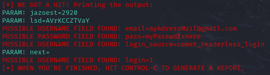

# Simulation of Phishing Attack on Kali Linux

**Important Notice**  
This guide is for educational purposes or authorized testing only. Performing phishing attacks without permission is illegal and can result in severe consequences, including legal action.

## What is a Phishing Attack?
A phishing attack is a type of cybercrime where attackers impersonate legitimate organizations or individuals to trick people into revealing sensitive information, such as passwords, credit card numbers, or personal data. The attackers often use emails, fake websites, or messages.

**Most common Phishing Attacks:**

- Website Clone: fake replica of a legitimate website created by attackers to trick users into entering sensitive information. It’s often used in phishing attacks to steal data like passwords or payment details.
- Email Phishing: Fraudulent emails that look like they’re from banks, tech companies, or online services asking you to click on a link and enter personal information.
- Spear Phishing: A more targeted phishing attack where attackers research a specific individual or organization to make their messages more convincing.
- Smishing: Phishing attacks carried out via text messages (SMS) to trick users into revealing personal information.
- Vishing: Phishing attempts made over phone calls, often pretending to be from banks or government officials.

**It’s important to be cautious of unsolicited messages, verify the authenticity of requests, and avoid clicking on suspicious links.**

## Required Tools
To carry out this simulation, ensure the following system is installed and configured in a virtual test environment:

- **Virtual Machine**: A virtualized environment of a physical computer. It can perform almost all functions, including running applications and operating systems.
        - **You need to change the VM's network to 'Bridge' if you want to test it on your device outside the VM**       
- **Kali Linux**: A penetration testing and security auditing operating system.
- **SET Toolkit (Social-Engineer Toolkit)**: A pre-installed tool in Kali Linux for conducting social engineering tests.

## Step by Step

### 1. Gaining Administrator (Root) Access
To perform this test, you'll need administrator (root) access to Kali Linux. This will provide the necessary permissions to execute commands:

1. Open a terminal window.
2. Type `sudo su` and press **ENTER**.
3. Enter the password if prompted.

### 2. Launching the SET Toolkit
The **SET Toolkit** is an open-source tool designed to assist security professionals in conducting social engineering tests.

1. In the terminal, type `setoolkit` and press **ENTER**.
2. From the menu, choose option `1` for **Social Engineering Attacks** by typing `1` and pressing **ENTER**.
3. Next, select the attack vector, which defines how the phishing attack will operate. Type `2` for **Web Site Attack Vectors** and press **ENTER**.
4. Then, choose the method for harvesting credentials by typing `3` for **Credential Harvester Attack Method** and pressing **ENTER**.
5. Now, select option `2` for **Site Cloner** and press **ENTER**.
6. You will be prompted for the IP address of your Kali Linux machine. The IP address will already be shown in the terminal. Confirm it by pressing **ENTER**.
7. At the next prompt, enter the URL of the website you want to clone. In this case, type `http://www.facebook.com` and press **ENTER**. The SET Toolkit will create a cloned copy of the site and start capturing any login information entered on the fake site.

### 3. Finding Your Kali Linux Machine's IP Address

1. Open a new terminal window.
2. Type `ifconfig` and press **ENTER**.
3. Locate the `INET` address displayed. This is the IP address of your Kali machine.

### 4. Running the Test

1. On another machine, open any web browser (preferably in Incognito mode).
2. In the address bar, type the IP address of your Kali Linux machine.

You will see the "login screen" of the cloned Facebook site. Once a user enters their login information, the credentials will be displayed in the terminal of your Kali Linux machine.

**Attack Method**: Credential Harvester Attack Method  
**Cloning Method**: `Site Cloner or Custom Import` (If you want to test using Custom Import, check out this README: https://github.com/RLLKLLSS/cibersecurity-desafio-phishing/blob/master/README.md *Helped me a lot btw*)                            
**Obtaining the IP Address**: `ifconfig`  
**Cloned URL**: `http://www.facebook.com`

---

**Disclaimer**  
This guide is only for educational purposes. Unauthorized use of phishing techniques is illegal and unethical. Always ensure you have explicit permission before conducting penetration testing or ethical hacking activities.
